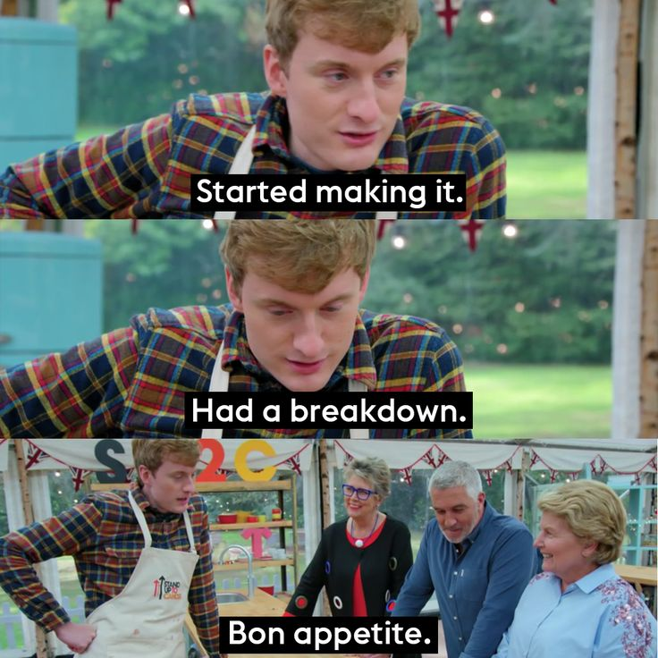
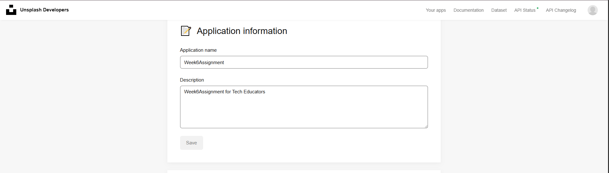
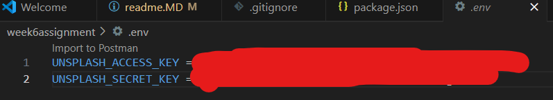

# Reflection

This week has been rough on me for a multitude of reasons, between illness and some personal bits going on. The latter I do not anticipate to be an issue over the coming weeks, just terrible timing for a culmination of things. The above image sums up my experience with this project well.

I spent most of the week working from home due to feeling unwell Tuesdays - Thursday. 

Friday was a bit better, but still not great at taking things in. Thursday saw more focus on the careers assignments and putting some resources together for classmates new to LinkedIn for the groups/pages of possible use, as a severe PTSD trigger earlier in the day gave me some trouble and needed something low-level I could focus on whilst self-caring.

Saturday - Still wasn't feeling 100%, dizziness and balance off. Nearly tumbled a few times. Used to review resources and read up.

Unsplash API - Implemented at the start of getting things set up with Render first and foremost. The less I have to poke the beast the better. Even If I don't get to rendering this, I just wanted to get that sweet sweet extra tick on the stretch goals list.

Forgot to add Vite at the start of the API request in .env which caused a great deal of headaches, and feeling ridiculous for forgetting something so easy.

Render deploy emails are driving me crazy and demotivating me during downtime. Considering turning them off as it's wearing me down.

All in all, I can see how React makes so much more sense, but its really throwing me through a loop trying to get the groundwork in place. I'm going to be trying to find podcasts, videos, etc I can binge on the way into work, or blast into my subconscious as I sleep. 

The most adept way I've described this is that handling everything all in once place is like trying to nagivate MC Escher's staircase painting. Its there, and I can see it, but, WHAT AND HOW.

## Requesting feedback about a specific part of your submission.
- Please suggest any references and resources that may be useful that I may not have touched on so that I can try to absorb this as much as possible before the next project as I will be out on the Sunday of next week and have a bit shorter to work on this.

## What errors or bugs did you encounter while completing your assignment? How did you solve them?
- Render gave a 254 error, which was undefined, and lead to a rabbithole of attempts to fix and had no longs. Manny stepped in to advise I was pointing to the wrong folder and directing everything to the top level. Woops.

## What went really well and what could have gone better?
- Render continues to strike fear in my heart, but I am making progress.
- Being ill in the week led to my mind being mush for several days and whilst on paper everything makes sense, the brain was not brain-ing and led to a lot of re-reading the class notes, demos, external resources to make heads or tails of it. 
- Mushy brain hours were used for finding some useful coding resources, tools, and putting together some useful resources for the LinkedIn assignment such as 100-ish+ groups for LI newbies including general, POC, neurodiverse, and LGBTQIA+ resources.

# Requirements
🎯 Implement the useState hook to manage gallery state (e.g. selected image).

✅ Use useEffect for initial fetching of images from an external API.

✅ Return JSX from multiple components (e.g., an ImageItem component for each image and a Gallery component to display them).
    ✅ Components create ✅ Fetching

✅ Use the .map() function to render an array of images dynamically

🎯 Implement functionality to display a larger version of an image when its thumbnail is clicked.
    ...uhhh, kinda? I mean, its there just at the same size. I'm stopping here though.

✅ Ensure all images have meaningful alt text.
    ✅ Alt fetched - ✅ Rendered

✅Ensure basic keyboard navigation for image selection (e.g., thumbnails should be focusable and activatable with Enter/Space).

# Stretch Requirements
🏹 Use useEffect and the dependancy array to update the images when the user types in an input field.

🏹 Set up an Unsplash application that you can fetch from your React app.
   
   ✅ Application set up
   
   
   🏹 Fetching data

✅ Use .env to hide your API keys and tokens from the code.

🏹 Style the application excellently, using grid or flex and positioning.

# References
[Dev.To](https://dev.to/)
[Reddit](https://reddit.com)
[MDN](https://developer.mozilla.org/)
[W3C](https://www.w3.org/)
[React](https://react.dev/)
[CssHero](https://csshero.org/)
[SheCodes](https://shecodes.io/)
[StackOverflow](https://stackoverflow.com/)
Google Gemini used for catching any case-mismatches and spelling mistakes. Hooks requiring caps is throwing me off and kept missing things out when referring to stuff, and editing structure to more relevant bits.